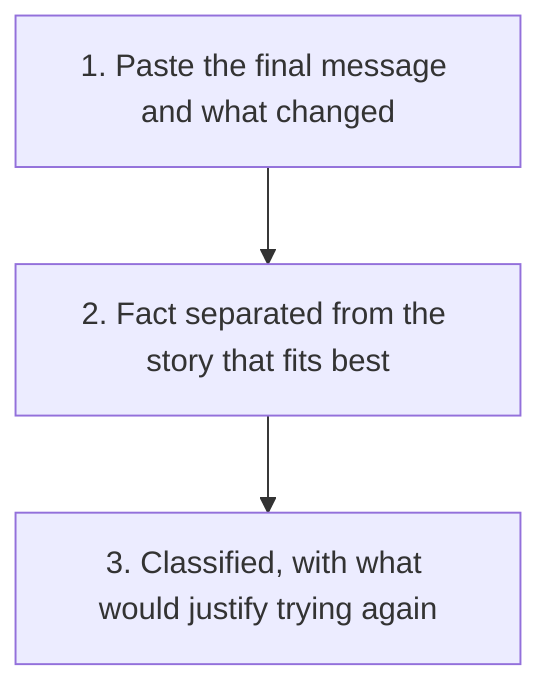

# Post-Mortem Builder

  
  

Work out whether a failed initiative, a rejected application, a cancelled project, a pitch that went nowhere, is genuinely over or just blocked, and what would actually justify trying again.

## Why

A stated reason for a failure is rarely the whole story, and "it didn't work out" usually hides several genuinely different situations: a real dealbreaker that will not change, a temporary pause with its own timeline, a thread that just needs a normal follow-up, or a clear no that should stay closed. Treating all four the same way gets at least one of them wrong, chasing something that has clearly ended, or writing off something that has not.

## Use It

Copy [SKILL.md](SKILL.md) and paste it into your AI tool (ChatGPT, Claude, Gemini, or similar), then paste in the final message or record, and whatever you know about what changed. It classifies the outcome as one of:

- **A hard blocker**, a real requirement that was not met and is unlikely to change
- **Timing**, the fit is real, the moment is not, usually with a stated future trigger
- **A contact change**, the person is gone, the case may still be usable through someone else
- **An unresolved concern**, something specific was raised, answered, and still rejected
- **A no-decision**, an answer was sent back and then contact simply stopped, which is not a rejection at all

See [the worked example](example/): four fictional cases, a rejected job application, a paused grant, a quiet partnership pitch, and an unconditional decline, testing whether the classifications actually get told apart from each other. [The second worked example](example-two/) tests a harder case: a stated reason that blends three factors together with no clear primary one.

<strong>See exactly what it produces</strong>

1. What was actually said or shown, kept separate from a tidier story
2. Whether the underlying case still stands, checked independently of who was involved
3. A classification: hard blocker, timing, contact change, unresolved concern, or no-decision, or an honest "blended, none confirmed as primary" where that is genuinely the case
4. What would actually justify trying again, or a plain statement that nothing would

Use [the blank template](templates/post-mortem-template.md) for your own case, and [the review checklist](checks/checklist.md) before deciding whether to try again.

No installation, project, or coding required to try it once.

## Before You Use It

This produces an analysis and a recommendation. Whether to actually try again, and any message sent, stays a deliberate decision you make yourself. It will never suggest a reason to re-approach someone who has given a clear, unconditional no.

## Licence

MIT.

## Feedback

Used it on a real case? [Start a discussion](https://github.com/shaunmarsden/post-mortem-builder/discussions) if a classification did not fit or a category was missing.

## Part of a Family

This is one of a family of free tools generalising [practical-ai-sales-workflows](https://github.com/shaunmarsden/practical-ai-sales-workflows) patterns beyond sales. See [sibling-projects](https://github.com/shaunmarsden/sibling-projects) for the rest, or use [the router](https://github.com/shaunmarsden/sibling-projects/blob/main/ROUTER.md) if you are not sure which one actually fits.
